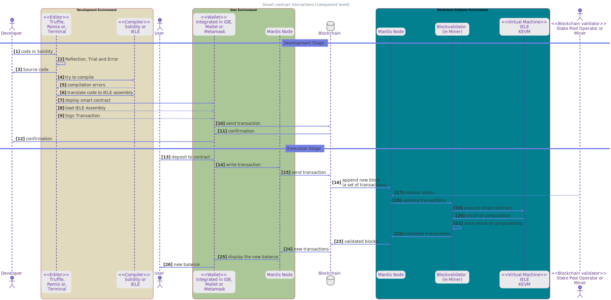

**Smart Contracts with KEVM and IELE Architecture**

In order to execute smart contracts in a blockchain there are many technologies involved. And all the different moving parts can become difficult to understand. In this article we are to look at the big picture first and then drill down, so that the components and their interactions become clearer.

# Context level view

From a 10,000 ft view the interactions are easy to grasp. There are developers, users and validators. All of them interact with each other indirectly by storing actions in a blockchain. Each one of the actors have different goals.

1.  > **A developer**

    1.  > Codifies the smart contract and deploys it \[1,2\].

    > **A user**

    2.  > Interacts with the smart contract by transactions stored \[3,4\]

    > **A blockchain validator**

    3.  > Blockchain validator (aka stake pool operator or miner)  is the one responsible to add blocks and also execute the smart contracts and record the result of the execution in the blockchain. \[5-7\].

Once we understand the goals of each actor in this process we can understand the needs for different pieces of software.

It's worth pointing out that, while coding, a developer will actually play the three roles.

# Container Level

Of course, in order to interact with the blockchain each actor requires specialized software. Zooming in the chart, we can see what each actor uses as its main software. This tools looks like

A Developer uses a Development Environment that can be either: Remix IDE, Truffle Suite or a combination of tools (editor, compiler and minimal wallet) to deploy the smart contract. Whatever the tools, what is important to remember is that the quality of these programs is paramount since defects in them translate directly to losses in assets.

A user uses a wallet + Mantis node to make transactions. Transactions is how a normal user interacts with a smart contract.

And a stake pool operator (or miner depending on the blockchain) with its node (composed of several pieces of software). To validate and append nodes to the blockchain.

# Component Level

Zooming in once more, we can see in detail what is inside each component.

1.  > **A Development Environment**

    1.  > Is composed of a Text Editor, a Compiler (either to IELE or KEVM), and a Wallet (for deploying the smart contract). When using an IDE such as Remix or Truffle all the components are integrated. Whereas when using a terminal each component is an actual program invoked from the command line.

    > **Stake Pool Node**

    2.  > Has three parts: One is a Mantis node (the same as the user) so that it downloads a copy of the blockchain. It also requires a block validator (commonly known as miner) that validates the new transactions inside a block. When the transaction is one for a smart contract (or the block number has reached a certain point). It goes and executes the smart contract on a Virtual Machine. That can be either the IELE VM or the KEVM. With the results calculated the block validation process continues as usual.

# How does it actually look?

Diagrams are all nice and pretty, but How do these components look when a developer is working with them?

In this video [Lars Brünjes](mailto:lars.bruenjes@iohk.io) , director of education at IOHK develops a smart contract using the Solidity to IELE compiler and the Mallet wallet.

As we have seen in order to get smart contracts to execute several pieces of software need to be in place. However the basic interaction between a Developer, User and Stake Pool operator are very simple. As long as we keep that in mind, and remember what stage of development we are at is clear which program is doing what.
