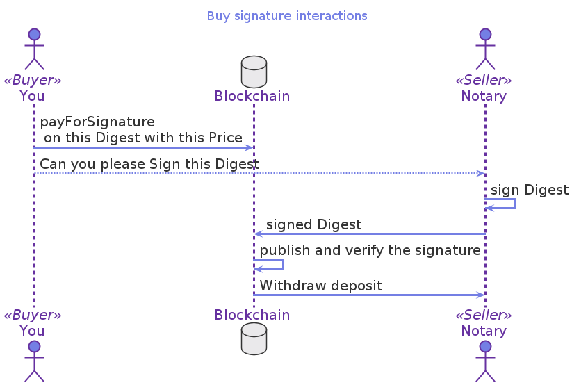

# [Buy Signature](https://gitlab.com/mukn/glow/-/blob/master/future/buy_sig.glow)

Let's imagine you want to have your testament notarized. What would you do?

> You first write your testament
> You pay a notary to stamp it
> You store a copy for future reference

If you think about it, there are many interactions in the world that follow that same process:

-   When your diploma is certified by your University.
-   When you renew your driver's license, there is no test, just a renewal stamp.

We could generalize the  process as:

> A buyer (you in this case)
> Pays a seller
> Takes something, or better yet, a representation of the item (a digest) to a seller.
> The seller can now sign the digest.
> All parties can see that the digest was signed.

This is the interaction that the `buy_sig.glow` contract represents.

## Visualizing the Buyer and Seller interactions

## Glow code

    1    #lang glow
    2    @interaction([Buyer, Seller])
    3    let payForSignature = (digest : Digest, price : Assets) => {
    4      deposit! Buyer -> price;
    5      @verifiably!(Seller) let signature = sign(digest);
    6      publish! Seller -> signature;
    7      verify! signature;
    8      withdraw! Seller <- price;
    9    }

2.  Buyer and seller have agreed to the terms of this sale. They both know what the signature is about, and they want to conduct this sale.
3.  The digest of the message to sign is a parameter of the interaction, as is the convened price.
4.  The buyer deposits the money according to the price.
5.  The seller signs, but it is private only to the seller.
6.  The signature is made public for everyone to see.
7.  The signature is verified by everyone in a way that the contract enforces.
8.  Finally, the money is transferred to the seller.

There are several things to note:

1.  The code looks a lot like the sequence diagram we created before.
2.  The lines of code with @Seller annotation are private.
3.  The language itself takes care of requirements. If the buyer never deposits, then the seller never will be able to sign.

## Lessons learned

-   Identify the participants of a contract with `@interaction`

When an instruction is annotated with the participant's name, that value is private for the participant. Like `@verifiably!(Seller)`

-   There are clear instructions for `deposit!` and `withdraw!`
