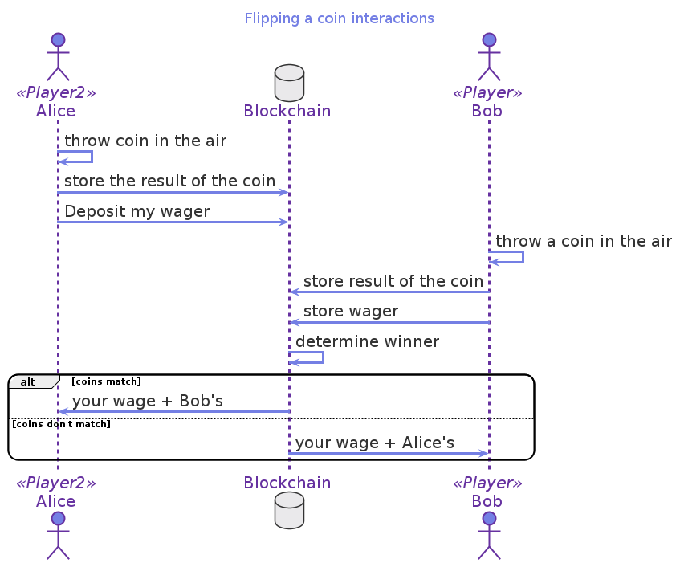

# How can you flip a coin in Glow? (coinflip.glow)

Flipping a coin is a game as old as, well, coins.
Alice throws the coin *in the air*,
Bob calls whatever he thinks is going to be the outcome.
The loser pays the winner the agreed amount.

However, on blockchain, there is no such thing as *in the air*.
So, how can we have something random that has a 50 / 50 chance for Alice?

For example, Alice flips her coin.
Bob flips his coin
And then Alice wins if both coins match.
Or Bob wins if the coins are different.
Both outcomes have a 50 / 50 chance of happening.

## Sequence diagram

## Glow code

The following Glow code exmaple represents the previous interaction:

     1  #lang glow
     2  @interaction([A, B])
     3  let coinFlip = (wagerAmount) => {
     4      @A assert! canReach(A_wins);
     5      @A let randA = randomUInt256();
     6      @verifiably!(A) let commitment = digest(randA);
     7      publish! A -> commitment; deposit! A -> wagerAmount;
     8      @B assert! canReach(B_wins);
     9      @B let randB = randomUInt256();
    10      publish! B -> randB; deposit! B -> wagerAmount;
    11      publish! A -> randA;
    12      verify! commitment;
    13      if (((randA ^^^ randB) &&& 1) == 0) {
    14          A_wins: withdraw! A <- 2*wagerAmount
    15      } else {
    16          B_wins: withdraw! B <- 2*wagerAmount
    17      }
    18  };

1.  Every Glow program starts with the #lang glow identification
2.  We know that two actors, A and B (Alice and Bob), are going to participate in this contract
3.  coinFlip needs to know the amount each player is going to bet to get started.
4.  Alice needs to be assured that there is a state where she can win. Ie. `assert!` makes sure that the program can reach the label `A_wins`
5.  Alice draws random numbers between 0 and 2256. Approx. 78 decimal digits.
6.  Alice stores in the commitment value the digest of the random number she generated.
7.  She publishes her commitment on the blockchain and deposits her wager.

Now it is Bob's turn:

8.  Bob makes sure that it is possible to get to the `B_wins` label to know that he can win.
9.  Bob flips a coin. i.e., draws a random number between 0 and 2256.
10. Bob publishes the coin that he flipped and deposits his wager.
11. Alice publishes the coin that she threw.
12. We `verify!` that the commitment matches the coin that she threw.
13. By doing a bitwise XOR of the random numbers thrown by Alice and Bob, we find that they match
14. Alice wins and withdraws two times the wager
15. However, If the `xor` doesn't match, Bob wins
16. In addition, Bob gets double the bet.

## Lessons learned

-   You can generate random numbers with `randomUInt256`
-   You can `assert!` you can reach a label such as `A_wins:`
-   There are bitwise operations with like `^^^` and `&&&`
