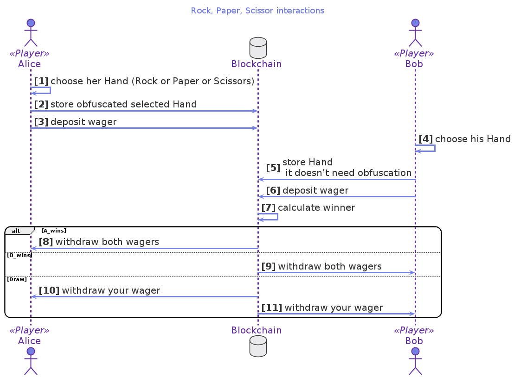

# Playing Rock, Paper, Scissors (rps-min.glow)

Rock, paper, scissors is the classic children's game where each child shows what they have chosen at the same time.
The decision on who has won is based on the following rules:

-   Both selected the same: Draw
-   Rock beats scissors
-   Paper beats rock
-   Scissors beats paper

How con you code this in Glow if there is no *at the same time*.
How does a player communicate their choice to the blockchain during the game?

## Visualization

## Glow code

     1  #lang glow
     2  data Hand = | Rock | Paper | Scissors;
     3  data Outcome = | B_Wins | Draw | A_Wins;
     4  let winner = (handA : Hand, handB : Hand) : Outcome => {
     5      Outcome.ofNat((Hand.toNat(handA) + (4 - Hand.toNat(handB))) % 3) }
     6
     7  @interaction([A, B])
     8  let rockPaperScissors = (wagerAmount) => {
     9      @A assert! canReach(end, end.outcome == A_Wins);
    10      @A let handA = Hand.input("First player, pick your hand");
    11      @A let salt = randomUInt256();
    12      @verifiably!(A) let commitment = digest([salt, handA]);
    13      publish! A -> commitment; deposit! A -> wagerAmount;
    14
    15      @B assert! canReach(end, end.outcome == B_Wins);
    16      @B let handB = Hand.input("Second player, pick your hand");
    17      publish! B -> handB; deposit! B -> wagerAmount;
    18
    19      publish! A -> salt, handA;
    20      verify! commitment;
    21      let outcome = winner(handA, handB);
    22    end: switch(outcome) {
    23        | A_Wins => withdraw! A <- 2*wagerAmount
    24        | B_Wins => withdraw! B <- 2*wagerAmount
    25        | Draw => withdraw! A <- wagerAmount; withdraw! B <- wagerAmount }}

2.  A `Hand` can only be `Rock, Paper or Scissors`
3.  There are only three possible `Outcome` either `B_wins`, `A_wins`, or its a `Draw`
4.  Now define a function `winner`, that when given two hands can determine the `Outcome`
5.  This is an arithmetic trick that translates each of the nine possible hand combinations to three possible outcomes
6.

7.  Alice and Bob use this contract
8.  Declare the `rockPaperScissors` contract that has the `wagerAmount`
9.  `@Alice` makes sure (`assert!`) that it's possible to reach the `end:` label
10. `@Alice` asks (`input`) and stores the value of her Hand.
11. `@Alice` creates a random value (`salt`) that will be used to obfuscate her Hand
12. `@Alice` store the obfuscated value of her Hand in a `verifiably` commitment
13. `@Alice` makes her commitment public and `deposit!` her wage.
14.

15. `@Bob` makes sure he can reach the `end.outcome` where he wins
16. `@Bob` can `input` what hand he chooses to play
17. `@Bob` publishes his Hand and deposits his wager
18.

19. Now it's possible to publish the `salt` and in the next step, use it to
20. `verify!` that the `commitment` was obfuscated with the salt
21. now we calculate the `outcome` as the result of evaluating the `winner` function with both hands.
22. `switch` for pattern matching, it's possible to select the appropriate outcome.
23. if `outcome` is `A_wins` `withdraw` to Alice both wages.
24. if `outcome` is `B_wins` `withdraw` to Bob both wages.
25. if `outcome` is `Draw` `withdraw` to give back their money to Alice and Bob.

## Lessons learned

-   You can define your data types with `data Hand`
-   You can define smaller functions that are used later in the contract. Like: `let winner = (handA:Hand, handB:Hand)`
-   You can use `switch` to do pattern matching
